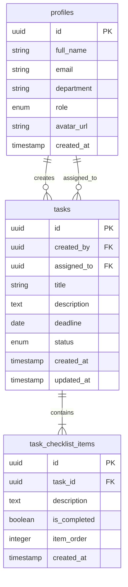

<div align="center">

# 📋 SealTask

### Sistema Interno de Gerenciamento de Tarefas

[](https://react.dev/)
[](https://www.typescriptlang.org/)
[](https://vitejs.dev/)
[](https://supabase.com/)
[](https://tailwindcss.com/)

**Gestão de tarefas moderna e eficiente para a Seal Store**

[Funcionalidades](#-funcionalidades) • [Tecnologias](#-tecnologias) • [Como Usar](#-como-executar) • [Configuração](#-configuração)

</div>

---

## 📖 Sobre o Projeto

O **SealTask** é um sistema completo de gerenciamento de tarefas desenvolvido especificamente para as necessidades da **Seal Store**. 

> 🎯 **Missão:** Digitalizar e modernizar o fluxo de trabalho interno, substituindo métodos manuais por uma solução tecnológica intuitiva e eficiente.

**Principais Benefícios:**
- 🚀 Aumento de produtividade com atualizações em tempo real
- 📊 Visibilidade completa do progresso das tarefas
- 🤝 Melhor colaboração entre gestores e equipes
- 📱 Acesso de qualquer dispositivo (mobile-first)

## ✨ Funcionalidades

<table>
<tr>
<td width="50%">

### 👔 Para Gestores

- ✅ **Criar tarefas completas**
  - Título, descrição detalhada e prazo
  - Atribuição individual ou por setor
  - Checklists com até 20 itens

- ✅ **Controle total**
  - Visualizar todas as tarefas do sistema
  - Editar e excluir tarefas
  - Acompanhar métricas em tempo real

- ✅ **Dashboard gerencial**
  - Estatísticas consolidadas
  - Visão geral de produtividade
  - Análise de status por equipe

</td>
<td width="50%">

### 👥 Para Colaboradores

- ✅ **Organização pessoal**
  - Tarefas atribuídas diretamente
  - Tarefas do setor em comum
  - Notificações de novidades

- ✅ **Atualização de progresso**
  - Marcar itens do checklist
  - Alterar status das tarefas
  - Comentar e dar feedback

- ✅ **Interface intuitiva**
  - Filtros avançados
  - Busca rápida
  - Visualização em cards expandíveis

</td>
</tr>
</table>

### 🔧 Recursos Técnicos

| Recurso | Descrição |
|---------|-----------|
| 🔄 **Realtime** | Sincronização automática de mudanças entre todos os usuários |
| 📱 **Responsivo** | Interface adaptável para desktop, tablet e mobile |
| 🖼️ **Avatar** | Upload e crop de foto de perfil em formato circular |
| 🔍 **Filtros** | Sistema de busca e filtragem por status, prioridade e atribuição |
| 🔐 **Autenticação** | Sistema seguro de login com controle de permissões por função |
| 📊 **Analytics** | Dashboard com métricas e estatísticas de produtividade |
| 🎨 **UI Moderna** | Design limpo e profissional com shadcn/ui components |

## 🛠️ Stack Tecnológico

<div align="center">

| Categoria | Tecnologia | Versão | Descrição |
|-----------|-----------|--------|-----------|
| **Frontend** | React | 18.3 | Biblioteca JavaScript para construção de interfaces |
| **Linguagem** | TypeScript | 5.8 | JavaScript com tipagem estática |
| **Build Tool** | Vite | 5.4 | Build tool ultrarrápido para desenvolvimento |
| **Styling** | Tailwind CSS | 3.4 | Framework CSS utilitário |
| **Componentes** | shadcn/ui | - | Componentes React reutilizáveis e acessíveis |
| **Backend** | Supabase | 2.89 | BaaS completo (Auth + Database + Storage + Realtime) |
| **State Management** | React Query | 5.83 | Gerenciamento de estado assíncrono e cache |
| **Formulários** | React Hook Form | 7.61 | Gerenciamento de formulários performático |
| **Validação** | Zod | 3.25 | Schema validation com TypeScript |
| **Roteamento** | React Router | 6.30 | Roteamento client-side |
| **Datas** | date-fns | 3.6 | Biblioteca moderna para manipulação de datas |

</div>

### 📦 Principais Dependências

```json
{
  "@supabase/supabase-js": "^2.89.0",      // Cliente Supabase
  "@tanstack/react-query": "^5.83.0",      // Data fetching e cache
  "react-hook-form": "^7.61.1",            // Formulários
  "zod": "^3.25.76",                       // Validação de schemas
  "lucide-react": "^0.462.0",              // Ícones
  "sonner": "^1.7.4"                       // Notificações toast
}
```

## 🏗️ Arquitetura do Banco de Dados



### 📊 Estrutura das Tabelas

<details>
<summary><b>👤 profiles</b> - Informações dos usuários</summary>

| Campo | Tipo | Descrição |
|-------|------|-----------|
| `id` | uuid | ID único do perfil (PK) |
| `full_name` | varchar | Nome completo do usuário |
| `email` | varchar | Email único do usuário |
| `department` | varchar | Setor/Departamento |
| `role` | enum | Papel (manager/member) |
| `avatar_url` | varchar | URL da foto de perfil |
| `created_at` | timestamp | Data de criação |

</details>

<details>
<summary><b>📋 tasks</b> - Tarefas do sistema</summary>

| Campo | Tipo | Descrição |
|-------|------|-----------|
| `id` | uuid | ID único da tarefa (PK) |
| `created_by` | uuid | ID do criador (FK → profiles) |
| `assigned_to` | uuid | ID do responsável (FK → profiles) |
| `title` | varchar | Título da tarefa |
| `description` | text | Descrição detalhada |
| `deadline` | date | Data limite |
| `status` | enum | Status (pending/in_progress/completed) |
| `created_at` | timestamp | Data de criação |
| `updated_at` | timestamp | Data da última atualização |

</details>

<details>
<summary><b>✅ task_checklist_items</b> - Itens do checklist</summary>

| Campo | Tipo | Descrição |
|-------|------|-----------|
| `id` | uuid | ID único do item (PK) |
| `task_id` | uuid | ID da tarefa pai (FK → tasks) |
| `description` | text | Descrição do item |
| `is_completed` | boolean | Status de conclusão |
| `item_order` | integer | Ordem de exibição |
| `created_at` | timestamp | Data de criação |

</details>

## 🚀 Como Executar

### Pré-requisitos

Certifique-se de ter instalado em sua máquina:

- **Node.js** (versão 18 ou superior) - [Download](https://nodejs.org/)
- **npm** ou **yarn** ou **bun** - Gerenciador de pacotes
- **Conta Supabase** - [Criar conta gratuita](https://supabase.com/)

### 📥 Instalação

1️⃣ **Clone o repositório**
```bash
git clone https://github.com/seu-usuario/seal-task-manager.git
cd seal-task-manager
```

2️⃣ **Instale as dependências**
```bash
# Usando npm
npm install

# Ou usando yarn
yarn install

# Ou usando bun
bun install
```

3️⃣ **Configure as variáveis de ambiente**

Copie o arquivo de exemplo e preencha com suas credenciais:
```bash
cp .env.example .env
```

Edite o arquivo `.env` com suas credenciais do Supabase:
```env
VITE_SUPABASE_URL=https://seu-projeto.supabase.co
VITE_SUPABASE_PUBLISHABLE_KEY=sua-chave-publica-aqui
```

> 💡 **Onde encontrar essas informações:**
> 1. Acesse [app.supabase.com](https://app.supabase.com)
> 2. Selecione seu projeto
> 3. Vá em **Settings** → **API**
> 4. Copie a **URL** e a **anon/public key**

4️⃣ **Configure o banco de dados**

Execute as migrations do Supabase no seu projeto:
```bash
# As migrations estão em /supabase/migrations/
# Execute-as diretamente no SQL Editor do Supabase Dashboard
```

5️⃣ **Inicie o servidor de desenvolvimento**
```bash
npm run dev
```

6️⃣ **Acesse o projeto**

Abra seu navegador em: **http://localhost:8080**

---

### 🔧 Scripts Disponíveis

| Comando | Descrição |
|---------|-----------|
| `npm run dev` | Inicia o servidor de desenvolvimento |
| `npm run build` | Cria build de produção |
| `npm run build:dev` | Cria build de desenvolvimento |
| `npm run preview` | Preview do build de produção |
| `npm run lint` | Executa o linter para verificar o código |

---

### 🌐 Deploy

O projeto está configurado para deploy automático na **Vercel**:

1. Faça push para a branch `main`
2. Configure as variáveis de ambiente no painel da Vercel
3. O deploy será feito automaticamente

## ⚙️ Configuração

### 🔑 Variáveis de Ambiente

O projeto utiliza as seguintes variáveis de ambiente:

| Variável | Descrição | Obrigatória | Exemplo |
|----------|-----------|-------------|---------|
| `VITE_SUPABASE_URL` | URL do projeto Supabase | ✅ Sim | `https://xxx.supabase.co` |
| `VITE_SUPABASE_PUBLISHABLE_KEY` | Chave pública do Supabase | ✅ Sim | `eyJhbGciOiJIUzI1...` |

### 🔐 Configuração de Segurança (Supabase)

#### Row Level Security (RLS)

O projeto usa políticas RLS para garantir que:
- ✅ Usuários só vejam suas próprias tarefas ou de seu setor
- ✅ Gestores tenham acesso a todas as tarefas
- ✅ Apenas criadores possam excluir tarefas

#### Políticas principais:

```sql
-- Exemplo de política para visualização de tarefas
CREATE POLICY "Users can view their own tasks"
ON tasks FOR SELECT
USING (
  auth.uid() = assigned_to OR 
  auth.uid() = created_by OR
  (SELECT role FROM profiles WHERE id = auth.uid()) = 'manager'
);
```

### 👥 Tipos de Usuário e Permissões

<table>
<tr>
<th>Permissão</th>
<th>Gestor (Manager)</th>
<th>Colaborador (Member)</th>
</tr>
<tr>
<td><b>Criar tarefas</b></td>
<td align="center">✅</td>
<td align="center">❌</td>
</tr>
<tr>
<td><b>Editar tarefas</b></td>
<td align="center">✅</td>
<td align="center">⚠️ Apenas status/checklist</td>
</tr>
<tr>
<td><b>Excluir tarefas</b></td>
<td align="center">✅</td>
<td align="center">❌</td>
</tr>
<tr>
<td><b>Ver todas as tarefas</b></td>
<td align="center">✅</td>
<td align="center">❌ Apenas atribuídas</td>
</tr>
<tr>
<td><b>Atualizar status</b></td>
<td align="center">✅</td>
<td align="center">✅</td>
</tr>
<tr>
<td><b>Marcar checklist</b></td>
<td align="center">✅</td>
<td align="center">✅</td>
</tr>
<tr>
<td><b>Dashboard completo</b></td>
<td align="center">✅</td>
<td align="center">⚠️ Apenas suas métricas</td>
</tr>
</table>

## � Estrutura do Projeto

```
seal-task-manager/
├── 📁 public/              # Arquivos públicos estáticos
├── 📁 src/
│   ├── 📁 components/      # Componentes React
│   │   ├── 📁 auth/        # Componentes de autenticação
│   │   ├── 📁 dashboard/   # Componentes do dashboard
│   │   ├── 📁 layout/      # Layout (Header, Sidebar)
│   │   └── 📁 ui/          # Componentes shadcn/ui
│   ├── 📁 contexts/        # Context API (AuthContext)
│   ├── 📁 hooks/           # Custom hooks
│   ├── 📁 integrations/    # Integrações (Supabase)
│   ├── 📁 lib/             # Utilitários
│   ├── 📁 pages/           # Páginas da aplicação
│   ├── 📁 types/           # Definições TypeScript
│   ├── App.tsx             # Componente principal
│   ├── main.tsx            # Entry point
│   └── index.css           # Estilos globais
├── 📁 supabase/
│   ├── config.toml         # Configuração Supabase
│   └── 📁 migrations/      # Migrations do banco
├── .env.example            # Exemplo de variáveis de ambiente
├── .gitignore              # Arquivos ignorados pelo Git
├── package.json            # Dependências do projeto
├── tsconfig.json           # Configuração TypeScript
├── vite.config.ts          # Configuração Vite
└── README.md               # Documentação (você está aqui!)
```

## 🎨 Design System

O projeto utiliza **shadcn/ui** com customizações para a identidade da Seal Store:

### Cores Principais

```css
/* Paleta de cores */
--primary: #0EA5E9       /* Sky Blue - Ações principais */
--secondary: #64748B     /* Slate - Elementos secundários */
--accent: #F59E0B        /* Amber - Destaques e alertas */
--success: #10B981       /* Green - Tarefas concluídas */
--warning: #F59E0B       /* Orange - Atenção */
--danger: #EF4444        /* Red - Erros e exclusões */
```

### Tipografia

- **Font Family:** `Inter`, system-ui, sans-serif
- **Font Sizes:** Escala modular de 12px a 48px
- **Font Weights:** 400 (Regular), 500 (Medium), 600 (Semibold), 700 (Bold)

## 📱 Screenshots

<details>
<summary>🖼️ <b>Ver capturas de tela</b></summary>

### 🏠 Dashboard
- Painel com estatísticas em tempo real
- Cards de tarefas organizados por status
- Filtros avançados (status, prioridade, atribuição)
- Barra de busca rápida

### ✏️ Criação de Tarefa
- Formulário intuitivo e validado
- Seleção de responsável ou setor
- Sistema de checklist dinâmico (até 20 itens)
- Seleção de data com calendário

### 👤 Perfil do Usuário
- Upload de avatar com crop circular
- Edição de informações pessoais
- Visualização de departamento e função
- Histórico de atividades

### 📊 Métricas (Gestor)
- Total de tarefas por status
- Taxa de conclusão
- Produtividade por setor
- Tarefas próximas ao vencimento

</details>

## 🤝 Contribuindo

Este é um projeto interno da Seal Store. Para contribuir:

1. 🔀 Crie uma branch para sua feature: `git checkout -b feature/nova-funcionalidade`
2. ✍️ Commit suas mudanças: `git commit -m 'Adiciona nova funcionalidade'`
3. 📤 Push para a branch: `git push origin feature/nova-funcionalidade`
4. 🔃 Abra um Pull Request

### 📋 Convenções de Código

- Use **TypeScript** para todo código novo
- Siga os padrões do **ESLint** configurado
- Componentes devem ter **tipagem forte**
- Use **React Hooks** ao invés de class components
- Nomeie componentes com **PascalCase**
- Nomeie funções e variáveis com **camelCase**

## 🐛 Reportar Problemas

Encontrou um bug? Tem uma sugestão? 

1. Verifique se já não existe uma issue similar
2. Abra uma nova issue descrevendo o problema
3. Inclua passos para reproduzir o bug
4. Adicione prints se possível

## 📊 Status do Projeto

- ✅ **v1.0** - Sistema base de tarefas (Lançado)
- ✅ **v1.1** - Sistema de checklist
- ✅ **v1.2** - Upload de avatar
- 🚧 **v1.3** - Notificações push (Em desenvolvimento)
- 📋 **v1.4** - Sistema de comentários (Planejado)
- 📋 **v2.0** - App mobile nativo (Planejado)

## 📄 Licença

Este projeto é de uso **exclusivamente interno** da **Seal Store**.

Todos os direitos reservados © 2025 Seal Store

---

<div align="center">

### 💙 Desenvolvido com dedicação para a Seal Store

**SealTask** - Gerenciando o futuro, uma tarefa por vez

[](https://supabase.com/)
[](https://vercel.com/)

</div>
